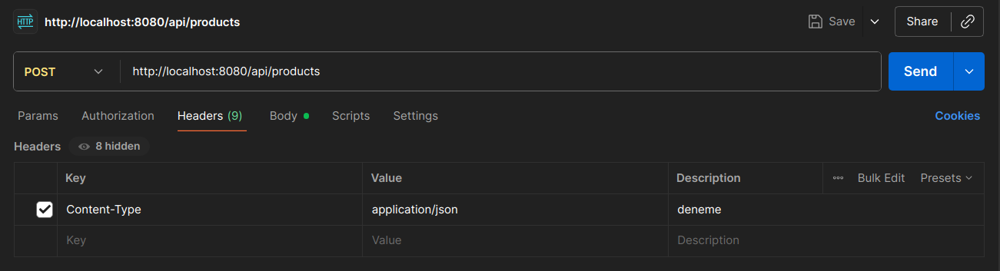
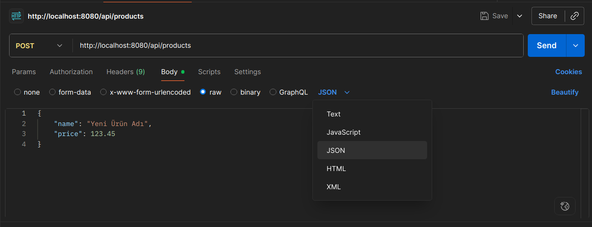

## POSTMAN Usage

Bu bölümde Spring Boot ile geliştirdiğim basit bir **REST API**'ye nasıl **POST** isteği atılacağı konusu ele alınmaktadır. **REST API** tasarım prensiplerine göre, bir sunucuya yeni bir kaynak (resource) oluşturmak veya veri eklemek için **POST HTTP** metodu kullanılır. Bizim örneğimizde, "yeni bir ürün" yaratmak istediğim için **POST** metodunu seçtik. Bu istekleri gerçekleştirmek için ***Postman*** adında popüler bir API test aracı kullanılmıştır.

İlk olarak, Postman uygulamasını bilgisayara kurmak için aşağıdaki komut kullanılmıştır:
```bash
sudo snap install postman
```


Ardından, Postman ile POST isteği göndermek için aşağıdaki adımlar izlenmiştir:

1. **Yeni İstek Oluşturma ve Metot Seçimi:**

   - Postman arayüzünde, sol üst köşedeki **`New`** butonuna tıklanır ve açılan menüden **`HTTP Request`** seçeneği seçilir.
   - Yeni açılan istek sekmesinde, URL giriş alanının solundaki açılır menüden **`POST`** metodu seçilir.

2. **URL Girilmesi:**

   - İstek atılacak adres, metodun yanındaki URL giriş alanına girilir: `http://localhost:8080/api/products`
   - **Gerekçe:**
     - `http://localhost:8080`: Uygulamamızın şu anda yerel bilgisayarımızda (localhost) varsayılan 8080 portunda çalıştığını belirtir. Spring Boot uygulaması başlatıldığında konsolda bu port numarasını görebilirsiniz.
     - `/api/products`: Bu yol, Spring Boot'taki `ProductController` sınıfımızın `@RequestMapping("/api/products")` notasyonuyla belirlenen temel adrestir. `ProductController` içindeki `addProduct` metodumuz `@PostMapping` notasyonuyla işaretlendiği için, `POST` istekleri bu URL'e yönlendirilir.

3. **Headers (Başlıklar) Kısmının Doldurulması:**

   - URL alanının altındaki sekmelerden **`Headers`** sekmesine tıklanır.
   - Yeni bir satır eklenerek aşağıdaki anahtar-değer çifti girilir:
     - **Key:** `Content-Type`
     - **Value:** `application/json`
   - **Gerekçe:** HTTP protokolünde, isteğin gövdesinde (body) gönderilen verinin formatını belirtmek için `Content-Type` başlığı kullanılır. Bizim API'mız JSON formatında veri beklediği için, `application/json` değeri sunucuya gönderdiğimiz ürün bilgilerinin JSON formatında olduğunu bildirir. Bu başlık sayesinde Spring Boot, gelen JSON verisini otomatik olarak Java'daki `Product` nesnesine dönüştürebilir.

   

4. **Body (Gövde) Sekmesinin Ayarlanması:**

   - `Headers` sekmesinin yanındaki **`Body`** sekmesine tıklanır.
   - `raw` ve `JSON` Seçimi yapılır:
     - Body seçeneklerinden **`raw`** (Ham) seçeneği seçilir. Bu, isteğin gövdesine doğrudan ham metin (JSON) yazacağımızı belirtir.
     - `raw` seçeneğinin sağındaki açılır menüden **`JSON`** türü seçilir. Bu, Postman'a yazdığımız içeriğin JSON formatında olduğunu bildirerek doğru vurgulama ve hata kontrolü sağlar.
   - **Gerekçe 1: `raw` Seçimi:** HTTP isteğinin gövdesine direkt olarak ham metin (bizim durumumuzda JSON) yazmak istediğimizi belirtir. Bu, JSON gibi yapılandırılmış veriler için en uygun seçenektir.
   - **Gerekçe 2: `JSON` Türünü Seçme:** Yazılacak metnin formatını belirtmek, Postman'ın yazım hatalarını kontrol etmesine ve okunabilirliği artırmasına yardımcı olur.

   

5. **Body Metin Kutusuna JSON Verisi Girilmesi:**

   - Geniş metin kutusuna, eklemek istenen ürünün JSON formatındaki bilgileri girilir. `id` alanı, sunucu tarafından otomatik olarak atanacağı için burada belirtilmez.

   - **Örnek JSON Verisi:**

     JSON

     ```json
     {
         "name": "Akıllı Telefon",
         "price": 999.99
     }
     ```

   - **Gerekçe:** REST API'lerinde veri alışverişi için en yaygın format JSON'dır. Girilen JSON'daki anahtar isimleri (`"name"`, `"price"`) Spring Boot tarafındaki `Product` sınıfının değişken isimleriyle (`name`, `price`) eşleşmelidir, böylece JSON verisi otomatik olarak bir `Product` Java nesnesine dönüştürülür.

6. **İsteği Gönderme:**

   - Tüm ayarlar tamamlandıktan sonra, sağ üst köşedeki **`Send`** butonuna tıklanarak istek sunucuya gönderilir.

